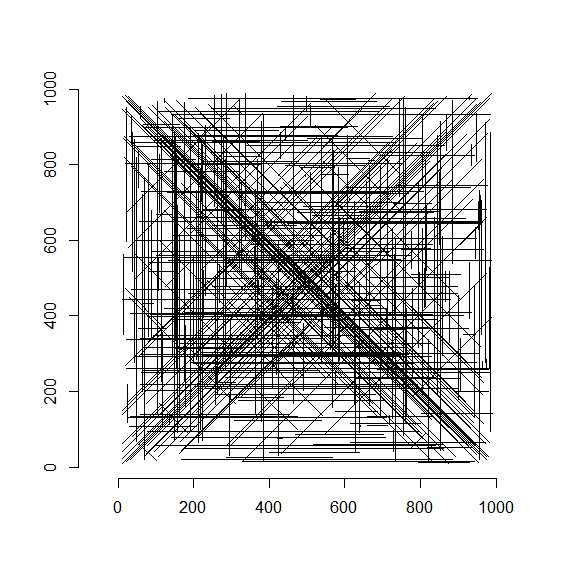
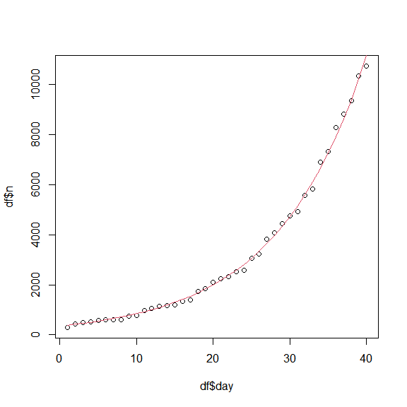
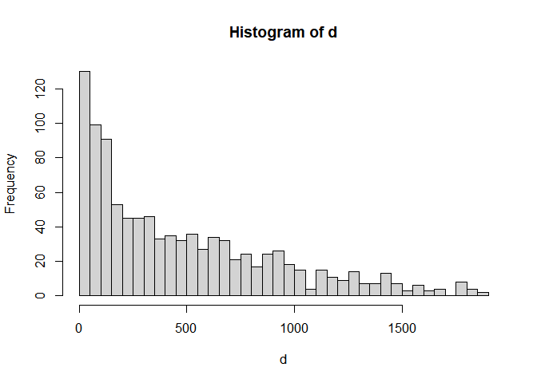

<!-- README.md is generated from README.Rmd. Please edit that file -->

# advent-of-code

Attempting the 2021 [advent of code](https://adventofcode.com/) in
**base R** only!

I am a massive fan and regular user of the tidyverse, but every now and
then I like to remind myself of what life used to be like…

# — Day 1: Sonar Sweep —

## 1a

``` r
d <- as.numeric(readLines('data/1-input.txt'))
sum(diff(d) > 0)
#> [1] 1167
```

## 1b

``` r
r <- sapply(1:(length(d)-length(d)%%3), function(x) sum(d[x:(x+2)]))
sum(diff(r) > 0)
#> [1] 1130
```

# — Day 2: Dive! —

## 2a

``` r
d <- readLines('data/2-input.txt')
direction <- sapply(strsplit(d, " "), `[[`, 1)
magnitude <- as.numeric(sapply(strsplit(d, " "), `[[`, 2))

horizontal <- sum(magnitude[direction == "forward"])
depth <- sum(magnitude[direction == "down"]) + sum(-magnitude[direction == "up"])
horizontal * depth
#> [1] 2120749
```

## 2b

``` r
l <- length(d) + 1
aim <- rep(0, l)
depth <- rep(0, l)
horiz <- rep(0, l)

for(i in seq_along(d)){
  if(direction[i] == "down"){
    aim[i+1] <- aim[i] + magnitude[i]
    depth[i+1] <- depth[i]
    horiz[i+1] <- horiz[i]
  } else if(direction[i] == "up"){
    aim[i+1] <- aim[i] - magnitude[i]
    depth[i+1] <- depth[i]
    horiz[i+1] <- horiz[i]
  } else if(direction[i] == "forward"){
    horiz[i+1] <- horiz[i] + magnitude[i]
    depth[i+1] <- depth[i] + (aim[i] * magnitude[i])
    aim[i+1] <- aim[i]
  }
}

horiz[l] * depth[l]
#> [1] 2138382217
```

# — Day 3: Binary Diagnostic —

## 3a

``` r
d <- readLines('data/3-input.txt')
m <- matrix(as.integer(unlist(strsplit(d, ""))), ncol = 12, byrow = TRUE)

gamma <- strtoi(paste0(as.integer(colMeans(m) > 0.5), collapse=""), base=2)
epsilon <- strtoi(paste0(as.integer(colMeans(m) < 0.5), collapse=""), base=2)

gamma * epsilon
#> [1] 1307354
```

## 3b

``` r
# O2
mi <- m
for(i in 1:ncol(mi)){
  if(nrow(mi) == 1) break
  mi <- mi[which(mi[,i] == round(ifelse(mean(mi[,i]) == 0.5, 1, mean(mi[,i])))),,drop = F]}
o2 <- strtoi(paste0(as.vector(mi), collapse = ""), base=2)

# CO2
mi <- m
for(i in 1:ncol(mi)){
  if(nrow(mi) == 1) break
  mi <- mi[which(mi[,i] == !round(ifelse(mean(mi[,i]) == 0.5, 1, mean(mi[,i])))),,drop = F]}
co2 <- strtoi(paste0(as.vector(mi), collapse = ""), base=2)

o2 * co2
#> [1] 482500
```

# — Day 4: Giant Squid —

## 4a

``` r
d <- readLines('data/4-input.txt')

# Extract numbers
nums <- as.integer(unlist(strsplit(d[1], ",")))

# Extract bingo boards
# trimws() to remove leading spaces for single digit numbers
# gsub() all double spaces to single spaces so I can strsplit() on single spaces
boards <-
  lapply(
    lapply(which(d == ""), function(x) gsub("  ", " ", trimws(d[(x+1):(x+5)]))),
    function(x) matrix(as.integer(unlist(strsplit(paste0(x, combine=" "), " "))),
                       ncol=5, byrow=TRUE))
```

-   Function to test if a matrix has a completed column or row (where
    completed numbers are NA)

``` r
is_bingo <- function(m){
  
  check_rows <- apply(m, MARGIN = 1, function(x) all(is.na(x)))
  check_cols <- apply(m, MARGIN = 2, function(x) all(is.na(x)))
  
  if(any(check_cols) | any(check_rows)){return(TRUE)} else {return(FALSE)}
}
```

``` r
boards_tmp <- boards

for(i in seq_along(nums)){
  
  # Update boards
  boards_tmp <- lapply(boards_tmp, function(x) replace(x, x==nums[i], values = NA))
  
  # Test for any with BINGO
  results <- sapply(boards_tmp, is_bingo)

  # If any board has BINGO, return results
  if(any(results)){
    print(paste0("BINGO!"))
    # hopefully only one board wins per number called...
    winning_board <- boards_tmp[[which(results)[1]]] 
    print(winning_board)
    winning_board_sum <- sum(winning_board[!is.na(winning_board)])
    number_called <- nums[i]
    break}
  }
#> [1] "BINGO!"
#>      [,1] [,2] [,3] [,4] [,5]
#> [1,]   46   52   40   12   44
#> [2,]    0   73   20   86    1
#> [3,]   NA   NA    4   NA   NA
#> [4,]   NA   NA   56   39   NA
#> [5,]   NA   NA   NA   NA   NA

winning_board_sum * number_called
#> [1] 23177
```

## 4b

``` r
boards_tmp <- boards

for(i in seq_along(nums)){
  
  # Update boards
  boards_tmp <- lapply(boards_tmp, function(x) replace(x, x==nums[i], values = NA))
  
  # Test for any with BINGO
  results <- sapply(boards_tmp, is_bingo)
  
  # If only one board remaining to get BINGO - save the ID of the board
  # This will then run every time until the final board is solved
  if(sum(!results) == 1){
    print("One board left to get BINGO")
    last_board_id <- which(!results)
  }

  # When all boards are solved, return the final board (solved) and the final
  # number called
  if(all(results)){
    print("All boards have BINGO")
    final_board <- boards_tmp[[last_board_id]]
    final_number <- nums[i]
    break
  }
}
#> [1] "One board left to get BINGO"
#> [1] "One board left to get BINGO"
#> [1] "One board left to get BINGO"
#> [1] "One board left to get BINGO"
#> [1] "All boards have BINGO"

sum(final_board[!is.na(final_board)]) * final_number
#> [1] 6804
```

# — Day 5: Hydrothermal Venture —

## 5a

-   Read data and wrangle to dataframe

``` r
d <- 
  do.call(rbind,
  lapply(
    strsplit(readLines('data/5-input.txt'), ' -> '),
    function(x) data.frame(x1 = as.numeric(strsplit(x, ",")[[1]][1]),
                           y1 = as.numeric(strsplit(x, ",")[[1]][2]),
                           x2 = as.numeric(strsplit(x, ",")[[2]][1]),
                           y2 = as.numeric(strsplit(x, ",")[[2]][2]))))
```

-   Visaulise all lines for interest

``` r
xmin <- min(c(d$x1, d$x2))
xmax <- max(c(d$x1, d$x2))
ymin <- min(c(d$y1, d$y2))
ymax <- max(c(d$y1, d$y2))

plot.new()
plot.window(xlim = c(xmin, xmax), ylim = c(ymin, ymax), asp=1)
segments(x0 = d$x1, x1 = d$x2, y0 = d$y1, y1 = d$y2)
axis(1)
axis(2)
```

<!-- -->

-   Subset to pure horizontal or vertical lines
-   Initialise empty list for output
-   Generate all coordinates along each line

``` r
sl <- d[(d$x1 == d$x2) | (d$y1 == d$y2),]

l <- list()
for(i in 1:nrow(sl)){
  if(sl$x1[i] == sl$x2[i]){
    # Pure horizontal
    l[[i]] <- paste0(sl$x1[i], ",", (sl$y1[i]:sl$y2[i]))
  } else if(sl$y1[i] == sl$y2[i]){
    # Pure vertical
    l[[i]] <- paste0((sl$x1[i]:sl$x2[i]), ",",  sl$y1[i])
  }
}

# Count unique coords and how many are appear twice or more
counts <- table(unlist(l))
length(counts[counts >=2])
#> [1] 7380
```

## 5b

-   Same as above but on the full data set adding a third else statement
    for diagonal lines
-   The question tells us diagonals are only ever at 45 degrees - so the
    computation of the coordinates is simple

``` r
l <- list()
for(i in 1:nrow(d)){
  if(d$x1[i] == d$x2[i]){
    # Pure horizontal
    l[[i]] <- paste0(d$x1[i], ",", (d$y1[i]:d$y2[i]))
  } else if(d$y1[i] == d$y2[i]){
    # Pure vertical
    l[[i]] <- paste0((d$x1[i]:d$x2[i]), ",",  d$y1[i])
  } else {
    # Diagonal
    l[[i]] <- paste0((d$x1[i]:d$x2[i]), ",",  (d$y1[i]:d$y2[i]))
  }
}

counts <- table(unlist(l))
length(counts[counts >=2])
#> [1] 21373
```

# — Day 6: Lanternfish —

> Each day, a 0 becomes a 6 and adds a new 8 to the end of the list,
> while each other number decreases by 1 if it was present at the start
> of the day.

-   Read data

``` r
d <- scan('data/6-input.txt', integer(), sep = ",")
```

## 6a

-   Create a dataframe showing the count of each day value
-   Left join to all possible day values (0:8) so I have all options
-   Iterate over 1 to 80 days shifting the day values by 1
    -   Zeros roll over to be eights (newly born lantern fish)
    -   Zeros also needed to be added to the current number of sixes as
        they start their cycle again

``` r
x <- table(d)
o <- merge(data.frame(d = 0:8), data.frame(x), all = TRUE)
o$Freq[is.na(o$Freq)] <- 0

for(i in 1:80){
  births <- o$Freq[o$d == 0]
  o$d <- c(o$d[9], o$d[1:8])
  o$Freq[o$d == 6] <- o$Freq[o$d == 6] + births}

sum(o$Freq)
#> [1] 372984
```

## 6b

-   Run again for 256 days

``` r
x <- table(d)
o <- merge(data.frame(d = 0:8), data.frame(x), all = TRUE)
o$Freq[is.na(o$Freq)] <- 0

for(i in 1:256){
  births <- o$Freq[o$d == 0]
  o$d <- c(o$d[9], o$d[1:8])
  o$Freq[o$d == 6] <- o$Freq[o$d == 6] + births}

options(scipen = 999)
sum(o$Freq)
#> [1] 1681503251694
```

-   For my own interest - plot the exponential growth and model it

``` r
x <- table(d)
o <- merge(data.frame(d = 0:8), data.frame(x), all = TRUE)
o$Freq[is.na(o$Freq)] <- 0

df <- data.frame(day = 1:40, n=NA)

for(i in 1:nrow(df)){
  births <- o$Freq[o$d == 0]
  o$d <- c(o$d[9], o$d[1:8])
  o$Freq[o$d == 6] <- o$Freq[o$d == 6] + births
  df$n[df$day == i] <- sum(o$Freq)}

mod <- nls(n~a*exp(b*day), data = df, start = list(a=1, b=0.1))
summary(mod)
#> 
#> Formula: n ~ a * exp(b * day)
#> 
#> Parameters:
#>      Estimate  Std. Error t value            Pr(>|t|)    
#> a 357.6742910  11.3410972   31.54 <0.0000000000000002 ***
#> b   0.0859893   0.0009015   95.38 <0.0000000000000002 ***
#> ---
#> Signif. codes:  0 '***' 0.001 '**' 0.01 '*' 0.05 '.' 0.1 ' ' 1
#> 
#> Residual standard error: 143.2 on 38 degrees of freedom
#> 
#> Number of iterations to convergence: 10 
#> Achieved convergence tolerance: 0.000001411
plot(df$day, df$n)
lines(predict(mod), col=2)
```

<!-- -->

# — Day 7: The Treachery of Whales —

-   Read data and visualise the distribution of starting positions for
    interest

``` r
d <- scan('data/7-input.txt', integer(), sep=",")
hist(d, 50)
```

<!-- -->

# 7a

``` r
min(sapply(seq_along(d), function(x) sum(abs(d[x]-d))))
#> [1] 345197
```

# 7b

``` r
new_fuel_cost <- function(x, starting_positions){
  simple_cost <- abs(starting_positions[x] - starting_positions)
  sum(sapply(simple_cost, function(x) if(x==0){0}else{sum(x:1)}))
  }

min(sapply(seq_along(d), new_fuel_cost, starting_positions = d))
#> [1] 96361606
```

# — Day 8: Seven Segment Search —

## 8a

``` r
d <- readLines('data/8-input.txt')

# Store patterns and output in a dataframe
l <- lapply(d, function(x) unlist(strsplit(x, " \\| ")))

df <- data.frame(pattern = sapply(l, `[[`, 1),
                 output = sapply(l, `[[`, 2),
                 stringsAsFactors = FALSE)
```

``` r
sum(unlist(lapply(lapply(df$output, function(x) unlist(strsplit(x, " "))), nchar)) %in% c(2, 4, 3, 7))
#> [1] 440
```

## 8b

-   Define a lookup of the segments used in each digit

``` r
segs <- c(
  "abcefg" = "0",
  "cf" = "1",
  "acdeg" = "2",
  "acdfg" = "3",
  "bcdf" = "4",
  "abdfg" = "5",
  "abdefg" = "6",
  "acf" = "7",
  "abcdefg" = "8",
  "abcdfg" = "9"
  )
```

-   I can really only apologise to anyone who stumbles upon this
    solution
-   I went down an inelegant, inefficient rabbit hole - and I just had
    to keep going to get out of the other side
-   It got the right answer but it’s awful. I don’t even want to come
    back and look at it!

``` r
decoded_outputs <- vector(length = nrow(df))
for(i in 1:nrow(df)){

  # Define a lookup vector to link cables to segments
  o <- setNames(rep(NA, 7), letters[1:7])
  
  # Make a dataframe with patterns (sorted alphabetically), their number of characters and their letters
  x <- sapply(unlist(strsplit(df$pattern[i], " ")), function(x) paste0(sort(unlist(strsplit(x, ""))), collapse = ""))
  t <- data.frame(x = x, stringsAsFactors = FALSE)
  t$nc <- sapply(t$x, nchar)
  t$l <- lapply(x, function(x) unlist(strsplit(x, "")))
  
  # A is the connection in 7 thats not in 1
  o["a"] = setdiff(t$l[t$nc == 3][[1]], t$l[t$nc == 2][[1]])
  
  # B/D are in 4 but not in 1 (but we're not sure which yet)
  tmp_bd <- setdiff(t$l[t$nc == 4][[1]], t$l[t$nc == 2][[1]])
  
  # The six segmen digits allow me to deduce which is which...
  # Which of the 6 segments digits have all segments in the 7 and the temporary BD segments
  six_segments <- t$l[t$nc == 6]
  
  nine <- which(sapply(six_segments, function(x) all(c(t$l[t$nc == 3][[1]], tmp_bd) %in% x)))
  o["g"] <- setdiff(unlist(six_segments[nine]), c(t$l[t$nc == 3][[1]], tmp_bd)) 
  
  six <- which(!(sapply(six_segments, function(x) all(t$l[t$nc == 2][[1]] %in% x))))
  o["e"] <- setdiff(unlist(six_segments[six]), c(o["g"], tmp_bd, t$l[t$nc == 3][[1]]))
  
  # Can now deduce the F and C segment connections
  o["f"] <- t$l[t$nc == 2][[1]][t$l[t$nc == 2][[1]] %in% unlist(six_segments[six])]
  o["c"] <- t$l[t$nc == 2][[1]][!t$l[t$nc == 2][[1]] %in% o["f"]]
  
  # Can now get B and D
  zero <- setdiff(seq_along(six_segments), c(six, nine))
  o["d"] <- tmp_bd[!tmp_bd %in% unlist(six_segments[zero])]
  o["b"] <- tmp_bd[!tmp_bd %in% o["d"]]
  
  # Add a column of the decoded pattern and the output number
  o <- setNames(names(o), o)
  t$real <- lapply(t$l, function(x) o[x])
  t$number <- sapply(t$real, function(x) segs[paste0(sort(x), collapse = "")])
  
  # Order each of the ouput digits alphabetically
  outputs <- sapply(unlist(strsplit(df$output[[i]], " ")), function(x) paste0(sort(unlist(strsplit(x, ""))), collapse=""))
  
  # Decode the outputs
  decoded_outputs[i] <- as.integer(paste0(sapply(outputs, function(x) t$number[t$x == x]), collapse=""))
  }

sum(decoded_outputs)
#> [1] 1046281
```

# — Day 9: Smoke Basin —

## 9a

``` r
d <- readLines('data/9-input.txt')
l <- nchar(d)

dm <- matrix(unlist(lapply(d, function(x) as.integer(unlist(strsplit(x, ""))))), ncol = l, byrow = TRUE)

# Buffer the matrix with a single element of value 10
dm <- rbind(matrix(10, nrow=1, ncol=l), dm, matrix(10, nrow=1, ncol=l))
dm <- cbind(matrix(10, nrow=l+2, ncol=1), dm, matrix(10, nrow=l+2, ncol=1))
```

``` r
o <- 
  dm[2:101, 2:101][(dm[2:101, 2:101] < dm[1:100, 2:101]) &  
                     (dm[2:101, 2:101] < dm[3:102, 2:101]) &
                     (dm[2:101, 2:101] < dm[2:101, 1:100]) &
                     (dm[2:101, 2:101] < dm[2:101, 3:102])]

sum(o+1)
#> [1] 560
```

## 9b
